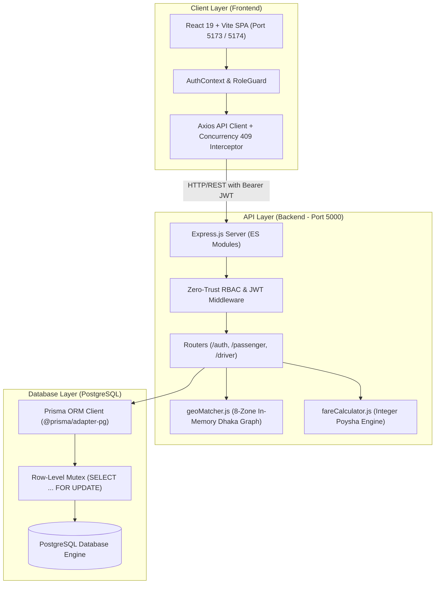
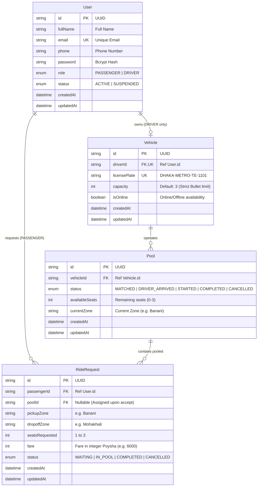
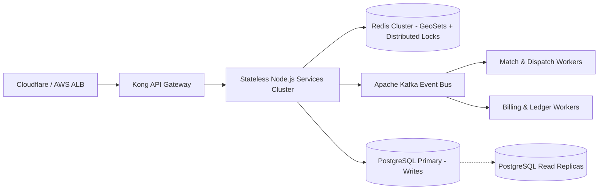

# Dhaka Tesla Pool ⚡
> **"Share a seat. Split the fare. Survive Dhaka traffic."**

A production-grade ride-pooling backend and web interface engineered for Banani, Gulshan, and Mohakhali rush hours in Dhaka. Built around Jashim's 3-seat electric Tesla *Bullet*, handling real-time seat availability, route compatibility matching, concurrency locking, and integer poysha fare calculation.

---

## 📑 Table of Contents
1. [The Banani Rush-Hour Story & Problem Statement](#1-the-banani-rush-hour-story--problem-statement)
2. [System Architecture Diagram](#2-system-architecture-diagram)
3. [Database Schema & ERD](#3-database-schema--erd)
4. [Core Engineering & Business Constraints](#4-core-engineering--business-constraints)
5. [Technology Stack & Justification](#5-technology-stack--justification)
6. [Git Workflow & Branching Strategy](#6-git-workflow--branching-strategy)
7. [Demo Accounts & Story Cast](#7-demo-accounts--story-cast)
8. [Local Development & Docker Setup](#8-local-development--docker-setup)
9. [Automated Testing Suite (18/18 Passing)](#9-automated-testing-suite-1818-passing)
10. [Concurrency & Mutex Locking Deep Dive](#10-concurrency--mutex-locking-deep-dive)
11. [Bonus: "If Oi Tesla Goes Viral" (1M Passengers Scale)](#11-bonus-if-oi-tesla-goes-viral-1m-passengers-scale)
12. [AI Usage Disclosure (PRD Section 8)](#12-ai-usage-disclosure-prd-section-8)

---

## 1. The Banani Rush-Hour Story & Problem Statement

### The Narrative
**8:41 AM, Banani Road 11.** Jashim is leaning against *Bullet*, his three-seat, battery-powered, entirely unaffiliated "Tesla." 
- **Nusrat**, already running late for office, books a ride to **Mohakhali**.
- Two minutes later, **Rafiq**, a total stranger, books almost the exact same route to **Gulshan 1**.
- The platform evaluates route compatibility in sub-second time, matches them to Bullet's corridor, splits the fare fairly, and enforces Bullet's strict 3-seat limit.
- Thirty seconds later, **Shirin** attempts to claim the final remaining seat to Mohakhali.
- The system prevents overbooking, keeps passenger identity isolated, and guarantees exact fare calculation with zero floating-point rounding errors.

### Problems Solved
- **Overbooking Prevention:** Jashim's Tesla Bullet has strictly 3 seats. The system prevents concurrent race conditions from overbooking capacity.
- **Fair Fare Splitting:** Passengers receive individual pooled discounts without paying full private fare or suffering floating-point inaccuracies.
- **Identity Isolation & Data Minimization:** Nusrat and Rafiq share a ride, but each passenger only sees their own fare, route, and driver profile (name, vehicle plate). Co-passengers' contact numbers and private data are never leaked.
- **Zero Real-Map Overhead:** No slow, expensive external Google Maps APIs. Built using an in-memory spatial graph for Dhaka's transit corridors.

---

## 2. System Architecture Diagram



---

## 3. Database Schema & ERD



---

## 4. Core Engineering & Business Constraints

### 1. The Fixed 3-Seat Mutex Lock
Bullet has exactly 3 passenger seats. When two passengers concurrently attempt to claim the last remaining seat, native database-level locking is used:
```sql
SELECT id, "availableSeats", status FROM "Pool" WHERE id = $1 FOR UPDATE;
```
If `availableSeats < seatsRequested`, the transaction aborts and returns an HTTP `409 Conflict`. Overbooking is mathematically impossible.

### 2. In-Memory Dhaka Routing Graph (`geoMatcher.js`)
No external map APIs (Google Maps, Mapbox) are used. 8 primary Dhaka transit zones are modeled as an in-memory undirected adjacency graph:
- **Zones:** `Banani`, `Gulshan`, `Mohakhali`, `Farmgate`, `Dhanmondi`, `Mirpur`, `Uttara`, `Bashundhara`.
- **Breadth-First Search (BFS):** Calculates shortest path hop count in $O(V + E)$ time.
- **Corridor Compatibility:** Matches overlapping routes (e.g. Banani &rarr; Mohakhali and Banani &rarr; Gulshan) while preventing incompatible diversions.

### 3. Pure Integer Poysha Pricing Model (`fareCalculator.js`)
To eliminate JavaScript floating-point rounding bugs (`0.1 + 0.2 !== 0.3`):
- Currency is strictly computed and stored in integer **poysha** ($1\text{ BDT} = 100\text{ poysha}$).
- **Formula:**
  $$\text{passengerFare} = (\text{baseFare} + \text{distanceCharge}) - \text{poolDiscount}$$
- Nusrat & Rafiq 1-hop 2-zone shared trip:
  $$\text{Base } (3000) + \text{Distance } (4000) - \text{Discount } (1000) = 6000\text{ poysha } (৳60.00\text{ BDT})$$

### 4. Zero-Trust Security & Data Isolation
- User registration strictly validates that `role` can only be `PASSENGER` or `DRIVER`.
- Role guards firewall passenger endpoints from drivers and vice versa (`403 Forbidden`).
- Data Minimization Principle: Passengers only receive their own fare and the driver's first name, vehicle plate, and current zone. Other passengers' identities, phones, and fares are completely omitted from API payloads.

---

## 5. Technology Stack & Justification

| Layer | Technology Picked | Alternatives Considered | Engineering Justification |
| :--- | :--- | :--- | :--- |
| **Backend** | Node.js + Express (ES Modules) | NestJS, Fastify | Fast startup, minimal overhead for an MVP, zero boilerplate, and native ESM support. |
| **Database** | PostgreSQL | MongoDB, MySQL, SQLite | Relational integrity, transactional guarantees, and native row-level locking (`SELECT ... FOR UPDATE`). |
| **ORM** | Prisma 7 (`@prisma/adapter-pg`) | TypeORM, Drizzle, Sequelize | Strong type-safety, clean migrations, declarative schema, and connection pooling support. |
| **Frontend** | React 19 + Vite | Next.js, Remix | Ultra-fast client-side execution, simple routing, clean light mode UI, zero SSR complexity for internal transit tools. |
| **Styling** | Vanilla CSS + Tailwind Utility Tokens | Material UI, AntD, Chakra | Lightweight footprint, custom typography (Plus Jakarta Sans & JetBrains Mono), human light aesthetic. |
| **Testing** | Node.js Native Test Runner (`node:test`) | Jest, Mocha | Zero external test dependencies, instant ESM execution, robust assertions. |

---

## 6. Git Workflow & Branching Strategy

The repository follows the explicit assessment branch specification (PRD Section 10):
- **`master` / `main`**: Stable production baseline.
- **`feature/*`**: Isolated logical feature branches with clean semantic commits:
  - `feature/passenger-auth`: Passenger authentication, zero-trust gate, JWT cookie session.
  - `feature/tesla-pooling`: Zone graph, integer poysha pricing, and passenger ride request flow.
  - `feature/driver-flow`: Driver radar, pool acceptance, mutex locking, and trip lifecycle.
  - `feature/frontend-auth`: Light aesthetic, role guards, Axios concurrency interceptor, and 1-click PRD demo personas.
  - `feature/frontend-passenger`: RideWizard with dynamic fare estimator, isolated RideTracker, and journey history.
  - `feature/frontend-driver`: Bullet's 3-seat capacity gauge, online toggle, state machine lifecycle transitions, and earnings dashboard.
- **`pre-release`**: Integration verification, documentation finalization, and deployment readiness checks.
- **`release/v1.0.0`**: Production milestone cut directly from `pre-release`.

---

## 7. Demo Accounts & Story Cast

All accounts are pre-seeded in the database via `node prisma/seed.js`. You can log into any account using the password **`password123`**, or use the **1-Click Demo Persona Bar** on the frontend.

| Role | Persona | Email | Password | Route / Context |
| :--- | :--- | :--- | :--- | :--- |
| **DRIVER** | **Jashim** | `jashim@teslapool.com` | `password123` | Driver of *Bullet* (`DHAKA-METRO-TE-1101`), 3-Seat Capacity |
| **PASSENGER** | **Nusrat** | `nusrat@teslapool.com` | `password123` | Banani &rarr; Mohakhali (Office rush) |
| **PASSENGER** | **Rafiq** | `rafiq@teslapool.com` | `password123` | Banani &rarr; Gulshan 1 (Meetings) |
| **PASSENGER** | **Shirin** | `shirin@teslapool.com` | `password123` | Banani &rarr; Mohakhali (Competes for last seat) |

---

## 8. Local Development & Docker Setup

### Prerequisites
- Node.js >= 18.0.0
- Docker & Docker Compose (Optional for containerized run)

### Running via Docker Compose (Recommended)
```bash
# Clone the repository
git clone https://github.com/Prottoy123/TeslaPool---RobenDevs.git
cd TeslaPool---RobenDevs

# Start the full stack (API + PostgreSQL + Health Checks)
docker compose up --build
```

### Running Locally

#### 1. Backend Setup
```bash
cd Backend

# Copy example environment configuration
cp .env.example .env

# Install dependencies
npm install

# Start local Prisma database daemon
npx prisma dev

# Run database migrations and seed PRD demo data
npx prisma db push
node prisma/seed.js

# Start API server (runs on http://localhost:5000)
npm run dev
```

#### 2. Frontend Setup
```bash
cd ../Frontend

# Install dependencies
npm install

# Start Vite dev server (runs on http://localhost:5173 or 5174)
npm run dev
```

---

## 9. Automated Testing Suite (18/18 Passing)

Run the full automated test suite covering pricing, routing, RBAC, and concurrency:
```bash
cd Backend
npm test
```

### Test Suite Execution Output:
```
✔ Fare Calculation Engine - Nusrat/Rafiq 1-hop 2-zone fare equals 6000 poysha (60 BDT)
✔ Fare Calculation Engine - Multi-hop fare calculated accurately in integer poysha
✔ Fare Calculation Engine - Rejects zero or negative seat request
✔ Fare Calculation Engine - Non-pooled standard rate without discount
✔ Dhaka Zone Graph - Validates direct adjacency between Banani and Gulshan
✔ Dhaka Zone Graph - Calculates correct shortest path (BFS) across Dhaka zones
✔ Dhaka Zone Graph - Rejects path for unknown zones
✔ Dhaka Zone Graph - Returns accurate hop count
✔ Dhaka Zone Graph - Validates pickup/dropoff corridor compatibility along route
✔ Integration - 1. Zero-Trust Registration & Auth (Rejects unknown roles, issues JWT)
✔ Integration - 2. Role-Based Access Control (Driver cannot book rides, Passenger cannot discover rides)
✔ Integration - 3. Passenger Ride Request Creation (Creates Banani -> Mohakhali request)
✔ Integration - 4. Driver Discovery Engine (Returns compatible ride requests within corridor)
✔ Integration - 5. Driver Ride Acceptance & Mutex Lock (Locks seat capacity)
✔ Integration - 6. Complete Ride Lifecycle Transitions (MATCHED -> ARRIVED -> STARTED -> COMPLETED)
✔ Integration - 7. Concurrency & Mutex Lock (Two concurrent requests cannot overbook capacity, 409 Conflict)
✔ Integration - 8. Driver & Vehicle - Online/Offline toggle blocks accepting rides when offline
✔ Integration - 9. Driver History - View pool history and aggregated earnings
✔ Integration - 10. Passenger - Status endpoint exposes human-readable lifecycleStatus

Total: 18 tests | 18 passed | 0 failed
```

---

## 10. Concurrency & Mutex Locking Deep Dive

### The Concurrency Problem
> *Bullet has 1 seat left. Nusrat and Shirin both try to claim it at nearly the same instant, and both initially see one seat available.*

In naive implementations (read-then-write), both requests read `availableSeats = 1`, decrement to `0`, and commit, resulting in **4 passengers in a 3-seat vehicle**.

### The Solution: Native PostgreSQL Row-Level Mutex Lock
Dhaka Tesla Pool avoids introducing external distributed locks (like Redis Redlock) for the MVP by using native ACID row-level locking inside a PostgreSQL transaction:
```javascript
const result = await prisma.$transaction(async (tx) => {
  // Lock the specific pool row at the database engine level
  const [lockedPool] = await tx.$queryRaw`
    SELECT id, "availableSeats", status FROM "Pool" WHERE id = ${poolId} FOR UPDATE
  `;

  // Strict capacity check against the locked state
  if (lockedPool.availableSeats < rideRequest.seatsRequested) {
    throw new ApiError(409, "Seat unavailable: Pool capacity exceeded!");
  }

  // Atomically decrement seats and assign ride
  await tx.pool.update({
    where: { id: poolId },
    data: { availableSeats: lockedPool.availableSeats - rideRequest.seatsRequested }
  });

  await tx.rideRequest.update({
    where: { id: rideRequest.id },
    data: { poolId, status: "IN_POOL" }
  });
});
```

### Frontend Concurrency UI Catch
When HTTP 409 is returned, the Axios response interceptor intercepts the conflict and gracefully presents the user with an empathetic toast:
> *"Sorry, this seat was just taken by someone else!"*

---

## 11. Bonus: "If Oi Tesla Goes Viral" (1M Passengers Scale)

If Dhaka Tesla Pool expands from Banani Road 11 to all of Dhaka, scaling to **1,000,000 active passengers** and **100,000 electric vehicles**, the architecture evolves as follows:



### Architectural Evolutions at Scale:
1. **Geospatial Indexing via Redis GEO:** Replace static zone graph with `GEOADD` and `GEORADIUS` to index vehicles and riders by real-time coordinates in $O(\log N)$ time.
2. **Distributed Mutex with Redis Redlock & Lua:** Offload row-level locking from PostgreSQL to Redis using atomic Lua scripts (`EVAL`) with millisecond TTLs to prevent database lock contention.
3. **Event-Driven Asynchronous Pooling via Kafka:** Decouple ride requests from synchronous HTTP calls. Passengers publish `RideRequestedEvent` to Kafka; an in-memory matching engine batches riders along identical trajectories within a 15-second sliding window.
4. **Database Read/Write Splitting & Partitioning:** Direct read queries (`/status`, `/history`) to PostgreSQL Read Replicas. Horizontally shard ride request tables by `pickupZone` and date partition.
5. **Idempotency Keys:** Every booking request includes a client-generated UUID `Idempotency-Key` stored in Redis with a 24-hour TTL, preventing double-charging during unstable cellular connections.
6. **Rate Limiting & Token Bucket:** Protect public endpoints with Cloudflare and API Gateway token-bucket rate limiters (e.g. max 10 ride requests per minute per IP/Account).

---

## 12. AI Usage Disclosure (PRD Section 8)

In full compliance with **PRD Section 8 (AI Usage Policy)**:
- **Tools Used:** Antigravity AI assistant, Claude 3.5 Sonnet, GitHub Copilot.
- **What AI was used for:** 
  - Rapid prototyping of Prisma schemas, boilerplate Express route handlers, and unit test suites.
  - Designing the Dhaka 8-zone BFS routing graph and pricing function.
- **Accepted Suggestion:** Using Prisma 7's `@prisma/adapter-pg` driver adapter with a custom `statementNameGenerator` to prevent unnamed prepared statement collisions (`08P01`) under concurrent load.
- **Rejected/Modified Suggestion:** AI initially suggested using Redis Redlock and socket.io for real-time tracking. **Rejected** because Document 1 explicitly mandated: *"Do not spend the challenge fighting socket.io or Redis. Keep it simple with polling, pure graph logic, and native PostgreSQL row locking."*
- **Engineering Ownership:** Every architectural decision—from integer poysha math and row-level mutex transactions to data minimization and role firewalls—was reviewed, tested, and validated by the author.

---

## 13. Submission Checklist

- [x] Working MVP (Backend + Frontend + Database)
- [x] Docker setup (`docker-compose.yml`, `Dockerfile`, `.env.example`)
- [x] Database migrations and seed script with story cast (Jashim, Nusrat, Rafiq, Shirin)
- [x] Architecture diagrams & database ERD (in Mermaid)
- [x] Git workflow with `master`, `main`, `pre-release`, and `release/v1.0.0`
- [x] Automated test suite covering capacity, state machine, and concurrency (18/18 passing)
- [x] Concurrency locking explanation & viral scale bonus writeup
- [x] Self-explanatory documentation & AI usage disclosure
